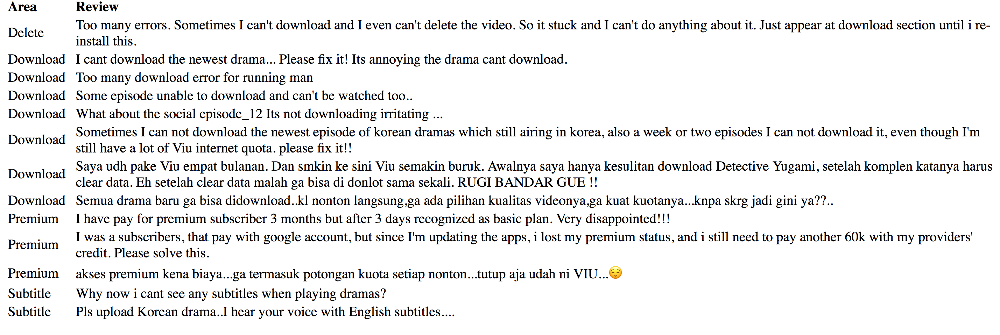

## Sentiment-Analyser

## About:
A utility to generate meaningful data from feedback given by actual users on Google Play Store. 
Helps to identify Features and Areas which needs improvement or bug fixes in the your mobile application.

 - It fetches Per Day/Day list/All Newest from Google Play Store for any specified Android application
 - Segregates and stores all the customer feedback into respective CSV files (filtered_reviews and newest_reviews)
 - Gives you a meaningful report mentioning areas to improve with the actual feedback
 - Can be used to get user's suggestions or feature requests
 - Can be customized to identify Features appreciated by customers

## Output:
- Generates a sorted HTML (review_report.html) file which contains Impacted Area and Reviews related to each area/functionality

- All the negative and newest reviews are stored in a CSV files

## Pre-requisite:
- Generate your APP_ID AND APP_KEY from [AYLIEN](https://aylien.com/) for accessing the APIs and add it to `fetch_analyse.rake`

## How to Run:
1. Integration with **CI** : `ci.sh` 

2. a. Apply Analytics on daily newest reviews about your app
   
   * `rake PACKAGE_NAME=<APK_PACKAGE_NAME> REVIEW_DATE=15 AYLIEN_APP_ID=<AYLIEN_APP_ID> AYLIEN_APP_KEY=<AYLIEN_APP_KEY> reviews:run:all`
   
   **For multiple days:**
   * `rake PACKAGE_NAME=<APK_PACKAGE_NAME> REVIEW_DATE=14,15 AYLIEN_APP_ID=<AYLIEN_APP_ID> AYLIEN_APP_KEY=<AYLIEN_APP_KEY> reviews:run:all`
   
   b. Generate a **Daily Report** for Areas/Functionality to Improve
    `rake PACKAGE_NAME=<APK_PACKAGE_NAME> REVIEW_DATE=6  reviews:run:output`
    
3. Fetch daily newest reviews about your app 
  `rake PACKAGE_NAME=<"Enter app package name"> REVIEW_DATE=<Day> reviews:fetch`
   - `rake PACKAGE_NAME=com.vuclip.viu REVIEW_DATE=15  reviews:run:fetch`
   
   
4. For Sentiment Analysis without any API of reviews/feedback
    `rake PACKAGE_NAME=com.vuclip.viu REVIEW_DATE=6  reviews:run:process`

## Sentiment Analysis:
 - Extract all negative and neutral reviews given by customers
 - Extract out App features/areas and functionalities that are impacted or affected
 - Stores all negative and neutral reviews in a file (negative_reviews.csv)

## What's Next:
- Making this utility to run on various feedback/review sources like twitter, Facebook etc
- Implement and Apply Machine Learning